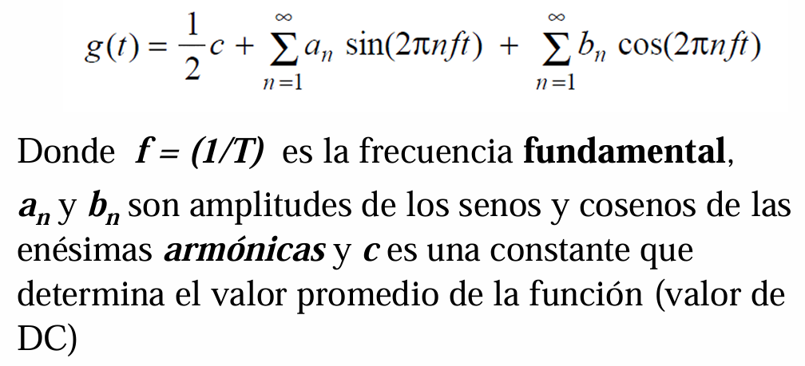
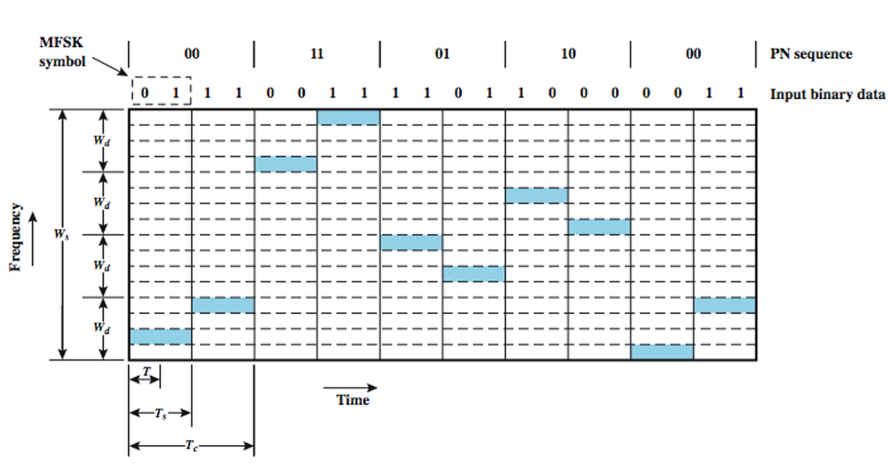
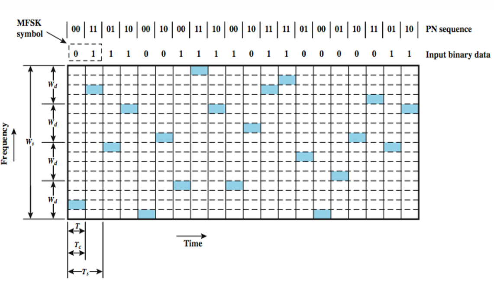
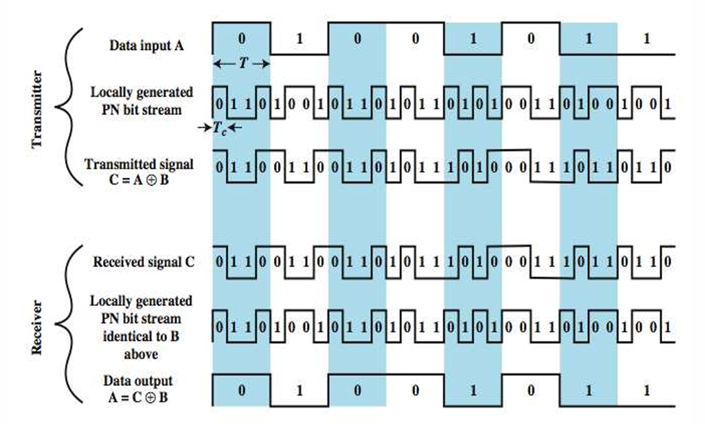
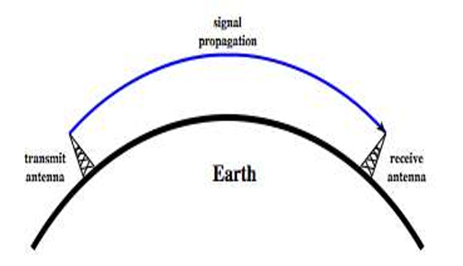
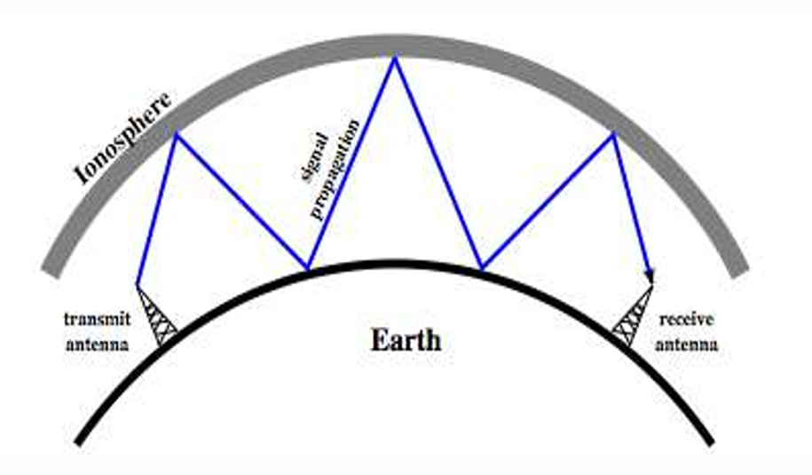
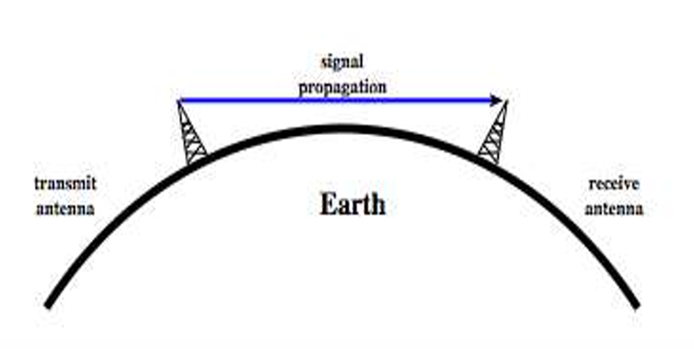

# Redes de Computadoras I: Medios de Transmisión y Capa Física 

La capa física es la capa más baja del modelo de referencia de redes y constituye la base sobre la que se construye toda la red [1]. Su objetivo fundamental es transportar los bits de información de una máquina a otra [2].

Para lograr este transporte, la capa física define las interfaces eléctricas, de temporización y otras mediante las cuales los bits se convierten en señales y se envían a través de los canales de comunicación [1]. Las propiedades de los diferentes tipos de canales físicos utilizados en esta capa son determinantes para el rendimiento de la red, afectando directamente factores como la capacidad de transferencia, la latencia (retardo) y la tasa de errores [1].

El estudio y funcionamiento de la capa física abarca varios conceptos y tecnologías fundamentales:

*   **Medios de transmisión:** Incluye los **medios guiados** o cableados que ya mencionamos (par trenzado, cable coaxial, fibra óptica, almacenamiento persistente y líneas de potencia) [2-4]. También incluye los **medios no guiados** o inalámbricos (como el espectro electromagnético, transmisión por radio, microondas, infrarrojos y luz) y la transmisión por **satélites** [3-6].
*   **Límites teóricos de comunicación:** La naturaleza impone límites físicos a la cantidad de información que se puede enviar por un canal [4]. La velocidad máxima de transmisión de datos está dictada por el ancho de banda del canal (medido en hercios, Hz) y la presencia de ruido térmico, conceptos que fueron formalizados por los teoremas de Nyquist (para canales sin ruido) y Shannon (para canales con ruido) [2, 7-10].
*   **Modulación digital:** Como los canales transportan señales analógicas (como variaciones continuas de tensión, intensidad de luz o sonido), la capa física se encarga del proceso de convertir estas formas de onda analógicas en bits digitales y viceversa [4, 11].
*   **Multiplexación:** Dado que tender cables para cada señal individual es costoso e ineficiente, la capa física utiliza esquemas de multiplexación para que múltiples transmisiones o conversaciones compartan un mismo medio físico simultáneamente sin interferir entre sí [4, 12, 13]. Esto se puede lograr dividiendo el canal por tiempo (TDM), por frecuencia (FDM) o por código (CDMA) [13].
  

## De formas de onda a bits

### Bases teóricas

Los **datos** son entidades que contienen un significado o información específica. Para ser transmitidos, se representan mediante **señales**, que son las formas eléctricas o electromagnéticas que efectivamente se propagan de manera física a través de un medio de comunicación. La **transmisión de datos** es precisamente el proceso de enviar esta información entre un transmisor y un receptor, lo cual se logra variando las propiedades de la señal a lo largo del tiempo.

Para estudiar las señales en el **dominio del tiempo**, se clasifican según su forma y comportamiento:
*   **Señal analógica:** Es aquella cuya amplitud varía suavemente y de forma continua en el tiempo.
*   **Señal digital:** Es aquella que mantiene un nivel constante (por ejemplo, un voltaje) durante un periodo y luego cambia abruptamente a otro nivel constante.
*   **Señales periódicas y aperiódicas:** Se definen por tener un patrón que se repite exactamente igual en el tiempo (periódica) o un patrón que no se repite (aperiódica).

### Análisis de Fourier

El puente fundamental para comprender cómo viajan estas señales físicamente es el **Análisis de Fourier**. Este principio matemático establece que cualquier señal en el tiempo se puede descomponer en una sumatoria de ondas sinusoidales (senos y cosenos), formadas por una frecuencia fundamental y múltiples armónicas con distintas amplitudes. Esta descomposición nos permite trasladar el estudio de las señales desde el dominio del tiempo hacia el **dominio de la frecuencia**.

Al analizar la transmisión en el dominio de la frecuencia, es imperativo distinguir entre tres conceptos interconectados: el espectro, el ancho de banda de la señal y el ancho de banda del canal.

**1. Espectro de la señal**
Es el rango total de frecuencias que están contenidas en una señal. Según el análisis de Fourier, si queremos representar una señal digital perfecta (como las variaciones abruptas de una onda cuadrada), necesitamos sumar infinitas armónicas. Por lo tanto, el espectro de una señal digital teórica es infinito.

**2. Ancho de banda de la señal**
Aunque el espectro pueda ser infinito, no todas las frecuencias que componen la señal tienen la misma potencia o importancia. El ancho de banda de la señal es el rango específico de frecuencias donde se concentra la mayor parte de su energía.

**3. Ancho de banda del canal**
Mientras que los dos conceptos anteriores describen a la señal, este describe al medio físico (cable de cobre, fibra óptica, el aire, etc.). Cualquier canal de transmisión tiene un rango máximo de frecuencias que es capaz de transportar sin sufrir una atenuación (pérdida de potencia) o distorsión severa. Esta es una **propiedad física** ineludible del medio, que depende de factores como la construcción, el grosor, la longitud y el material utilizado.

**La interacción fundamental para la transmisión de datos:**

La regla de oro de la comunicación física es que **un canal no puede transportar eficientemente una señal cuyo ancho de banda sea mayor que el suyo propio**.

Cuando una señal digital (con su amplio espectro) intenta viajar por un canal físico, este último actúa como un filtro. De todas las armónicas que componen la señal original, el canal solo dejará pasar intactas aquellas frecuencias que entren dentro de su ancho de banda limitado. Las armónicas de mayor frecuencia serán atenuadas o eliminadas por completo. 

Al perder estas frecuencias altas, la onda cuadrada pierde sus bordes rectos y sufre distorsión. Las imágenes de las diapositivas y los textos ilustran claramente este efecto: si un canal es muy limitado y solo deja pasar 1 armónica, la señal resultante es apenas una onda suave; si el ancho de banda es mayor y permite el paso de 2, 4 u 8 armónicas, la curva resultante se aproxima cada vez más a la onda cuadrada digital original. 

Afortunadamente para las redes de computadoras, el objetivo de la transmisión digital no es recibir una onda cuadrada matemáticamente perfecta. El objetivo es que el ancho de banda del canal deje pasar un número suficiente de armónicas para que el receptor pueda leer la señal con la fidelidad necesaria para reconstruir correctamente la secuencia de bits (los ceros y unos). Si se intenta transmitir a una tasa de bits tan alta que el ancho de banda del canal no permite el paso de los armónicos fundamentales, la señal llegará tan deformada que los datos se perderán irremediablemente.

### Señales de audio
Las señales de audio abarcan el espectro completo de frecuencias que el oído humano es capaz de percibir, el cual se sitúa en un rango de 20 Hz a 20 kHz. Sin embargo, dentro de este amplio espectro, la voz humana concentra la mayor parte de su información y energía en una banda mucho más estrecha, que va específicamente desde los 100 Hz hasta los 7 kHz. 

Una de las grandes ventajas de las señales de audio desde la perspectiva de las telecomunicaciones es que resultan muy fáciles de convertir a señales electromagnéticas análogas, facilitando así su transmisión a través de cables.

**Análisis a partir del gráfico de espectro de las diapositivas**

La imagen proporcionada en las diapositivas ilustra de manera muy clara cómo se distribuye la relación de potencia (medida en decibelios) de los distintos tipos de señales en función de la frecuencia. A partir de este gráfico podemos extraer varias conclusiones clave:

*   **Rango dinámico de la música:** La curva etiquetada como "MUSIC" demuestra que las señales musicales tienen un rango dinámico muy amplio. Su energía abarca desde frecuencias sumamente bajas (cerca de los 20 Hz) y se extiende hasta frecuencias muy altas que superan los 10 kHz, acercándose al límite superior de audición.
*   **Rango dinámico de la voz ("SPEECH"):** La curva de la voz humana muestra un comportamiento distinto. Comienza a tener una potencia significativa por encima de los 100 Hz y su curva decae mucho antes que la de la música. Esto confirma visualmente que la voz requiere un ancho de banda considerablemente menor para ser transmitida de forma inteligible.
*   **Limitación del canal telefónico:** El gráfico destaca un bloque rectangular fuertemente delimitado llamado "Telephone channel". Para optimizar el uso de los medios físicos, los sistemas telefónicos no transmiten toda la gama de frecuencias de la voz humana, sino que aplican filtros artificiales que cortan las frecuencias por debajo de los 300 Hz y por encima de los 3400 Hz. A este canal se le asigna un bloque estándar de 4000 Hz (4 kHz). En el gráfico, esto se ve como una "ventana" estricta a través de la cual debe pasar la señal de voz.
*   **Límites de radiodifusión y piso de ruido:** La imagen también contrasta estas señales con los límites superiores de transmisión de las radios AM y FM (siendo el de FM mucho más amplio que el de AM) y muestra un bloque rectangular en la parte inferior que representa el piso de "Noise" (Ruido), situado en el rango de -40 a -50 decibelios. Toda señal que caiga dentro de este piso oscuro corre el riesgo de perderse por las interferencias.

**Digitalización de la señal filtrada**

Esta limitación analógica de 4 kHz dictada por los filtros telefónicos es la base para la digitalización moderna. Cuando esta señal analógica de audio se introduce en la red troncal telefónica, un dispositivo llamado códec la transforma en bits mediante Modulación por Impulsos Codificados (PCM). Para cumplir con el teorema de Nyquist, la red toma exactamente 8.000 muestras por segundo de ese canal de 4 kHz. Al usar 8 bits por muestra, obtenemos la velocidad estándar mundial para enviar una llamada de voz digital: 64.000 bits por segundo (64 kbps).

### Impedimentos en la transmisión de datos

En los sistemas de comunicación, es común que la señal recibida difiera de la señal transmitida original. En el caso de las señales analógicas, esto se traduce en una degradación directa de la calidad de la señal, mientras que en las señales digitales provoca errores en los bits que componen los datos. 

Estas alteraciones se conocen como impedimentos en la transmisión de datos y se agrupan en tres grandes categorías principales: **atenuación, distorsión y ruido**.

A continuación te presento un análisis detallado de cada uno de estos impedimentos, incorporando la información visual que presentan las diapositivas y las fórmulas solicitadas:

**1. Atenuación**
La atenuación es la pérdida o caída de la potencia de una señal debido a la distancia que debe recorrer a través de un medio de transmisión. Es una propiedad física inherente al medio y se agrava considerablemente a frecuencias más altas: a mayor frecuencia, mayor atenuación. Para que una transmisión sea exitosa, la señal que llega al receptor debe ser lo suficientemente fuerte para poder ser detectada correctamente y debe tener un nivel de potencia superior al nivel del ruido.

*   **Análisis visual de las diapositivas:** Las diapositivas lo ilustran gráficamente mostrando una onda original ("Original") que, al viajar por el medio de transmisión hasta un Punto 2, pierde amplitud ("Attenuated"). Posteriormente, la señal pasa por un "Amplifier" (amplificador) amarillo que le devuelve su potencia, generando una onda mucho más grande ("Amplified") en el Punto 3.
*   **Fórmula relacionada a la atenuación:** La atenuación (o amplificación) se calcula comparando la potencia de salida o final ($P_2$) frente a la potencia de entrada o inicial ($P_1$), y se expresa en decibeles (dB). La fórmula fundamental es:
    
    **$dB = 10 \log_{10} \left( \frac{P_2}{P_1} \right)$**

    Las diapositivas proporcionan ejemplos prácticos de cómo usar esta fórmula:
    *   Si la señal viaja por el medio y su potencia se reduce a la mitad ($P_2 = 0.5 P_1$), la pérdida de potencia se calcula como: $10 \log_{10}(0.5) = 10(-0.3) = -3 \text{ dB}$.
    *   Si un amplificador incrementa la potencia de la señal 10 veces ($P_2 = 10 P_1$), la ganancia de potencia es: $10 \log_{10}(10) = 10(1) = 10 \text{ dB}$.
    *   Una de las ventajas de usar decibeles es que los tramos se pueden sumar directamente. En el esquema mostrado, un cable pierde $-3 \text{ dB}$, un amplificador suma $+7 \text{ dB}$, y el siguiente tramo de cable pierde otros $-3 \text{ dB}$. La atenuación total se calcula mediante una suma simple: $-3 + 7 - 3 = +1 \text{ dB}$.

**2. Distorsión**
La distorsión no es una pérdida de potencia, sino **la pérdida de la forma original de la señal**. Un aspecto muy importante es que la distorsión no se puede solucionar simplemente añadiendo amplificadores (ya que estos solo harían más grande la señal deformada), sino que requiere el uso de regeneradores de señal o repetidores para reconstruirla.
*   **Análisis visual de las diapositivas:** Para que el concepto sea fácil de entender, la diapositiva utiliza la analogía visual de una persona apuntando con un secador de pelo hacia la letra "A" pintada en un cuadro; el calor hace que la figura se derrita y las líneas de la letra comiencen a ondularse y deformarse, perdiendo su geometría original.
*   **Tipos de distorsión:**
    *   *Distorsión por atenuación (I):* Ocurre porque la atenuación no afecta por igual a todas las frecuencias. Es un problema crítico para las señales analógicas.
    *   *Distorsión por retardo (II):* Se da porque la velocidad a la que se propagan las ondas varía dependiendo de la frecuencia. Este tipo de distorsión es el factor más crítico para las señales digitales.

**3. Ruido**
El ruido se define como señales adicionales aleatorias e indeseadas que se insertan en la línea entre el transmisor y el receptor. 
*   **Análisis visual de las diapositivas:** Un gráfico muy representativo en la presentación muestra tres ejes temporales: primero, una "señal origen" digital limpia (una onda cuadrada que representa $1011001001101$); luego, el "ruido" que se presenta como una línea completamente irregular y caótica; y finalmente, la "señal deteriorada", que es el resultado de sumar las dos anteriores. En la señal deteriorada, los picos de ruido logran invertir el valor del voltaje, causando que algunos "0" se lean como "1" (resaltados en rojo), provocando errores de bits directos.

Las diapositivas catalogan el ruido en cuatro orígenes principales:
1.  **Ruido Térmico (i):** Causado por la agitación natural y aleatoria de los electrones en el medio. Tiene la característica de estar distribuido de manera uniforme a través de todas las frecuencias.
2.  **Ruido de Intermodulación (ii):** Se produce cuando señales de diferentes frecuencias comparten el mismo medio. Las imágenes de las diapositivas muestran que al entrar dos frecuencias ($f_1$ y $f_2$) a un amplificador, no solo salen estas, sino que se generan nuevas señales "fantasma" que son la suma y diferencia matemática de las mismas (por ejemplo, $2f_1-f_2$ y $2f_2-f_1$).
3.  **Diafonía o Crosstalk (iii):** Ocurre cuando la señal de una línea se acopla a otra. Gráficamente, las diapositivas lo representan mediante campos magnéticos concéntricos que irradian desde un cable activo e inducen corriente en un cable vecino que no debería tener esa señal.
4.  **Ruido Impulsivo (iv):** Son pulsos irregulares o picos de altísima amplitud pero de muy corta duración. Las diapositivas utilizan imágenes de **relámpagos en una tormenta eléctrica** y de **tubos fluorescentes** para ejemplificar de dónde proviene la interferencia electromagnética que lo causa. Aunque los sistemas analógicos pueden tolerarlo hasta cierto punto, es la **mayor fuente de errores para los datos digitales**, ya que un solo pico o destello rápido puede corromper muchísimos bits a la vez.

## Medios de transmisión guiados 

El concepto de **medio de transmisión guiado** se refiere a aquellos medios que utilizan un **cable o hilo físico** para transportar la información [1]. Reciben la denominación de "guiados" precisamente porque las transmisiones de las señales (que representan los bits) son canalizadas y dirigidas a lo largo de una ruta específica delimitada por la estructura de dicho material [1].

El propósito fundamental de estos medios dentro de la capa física de una red es **transportar bits de una máquina a otra** de manera confiable [1]. 

Cada tipo de medio guiado tiene propiedades físicas distintas que determinan el rendimiento de la red, presentando ventajas y desventajas particulares basadas en las siguientes características:
*   **Frecuencia y ancho de banda:** El ancho de banda es la medida de la capacidad de transporte que tiene el medio y se expresa en hercios (Hz, MHz o GHz) [1].
*   **Retardo:** El tiempo que le toma a la información viajar desde el origen hasta el destino [1].
*   **Costo, facilidad de instalación y mantenimiento:** Factores logísticos y económicos que determinan la viabilidad de implementar un medio sobre otro [1].

Los **medios de transmisión guiada más comunes son los cables de cobre**, que se presentan en formas como el par trenzado y el cable coaxial, y la **fibra óptica** [1]. Sin embargo, la clasificación también incluye otros métodos como el transporte físico de **almacenamiento persistente** (cintas, CD, discos duros) y el uso de **líneas de potencia eléctrica** [2-4].

La terminología para describir la direccionalidad de las comunicaciones en los enlaces de red se divide en las siguientes tres categorías:

Un enlace **full-duplex** (o dúplex completo) es aquel que **puede utilizarse en ambos sentidos al mismo tiempo**. Para visualizarlo fácilmente, se puede pensar en este tipo de enlace como **una carretera de dos carriles**, donde los vehículos (en este caso, los datos) pueden viajar simultáneamente en direcciones opuestas de manera continua y sin interferir entre sí. Un ejemplo de esto en el contexto de los cables de par trenzado es el estándar Ethernet a 1 Gbps, el cual logra utilizar los cuatro pares de hilos disponibles en ambas direcciones de manera simultánea.

Un enlace **semidúplex** (o half-duplex) es aquel que **permite la comunicación en ambos sentidos, pero sólo en un sentido a la vez**. La analogía que describen los textos para este escenario es **una línea de ferrocarril de una sola vía**. Los trenes pueden ir de un punto A a un punto B, y también del punto B al punto A, pero nunca simultáneamente, ya que chocarían; obligatoriamente deben alternar el uso de la vía. En las comunicaciones de red, esto significa que los dispositivos conectados deben turnarse para transmitir y recibir la información.

Finalmente, un enlace **símplex** es aquel que **sólo permite el tráfico de datos en una única dirección de forma permanente**. Este tipo de conexión funciona de manera idéntica a **una calle de sentido único**, donde la información fluye exclusivamente desde un dispositivo transmisor hacia un receptor, sin ninguna posibilidad de que el receptor envíe información de vuelta por ese mismo canal. Un ejemplo físico de esto, tal como lo señalan los documentos, es un sistema básico de fibra óptica compuesto por una fuente de luz en un extremo y un fotodetector en el otro, lo cual crea inherentemente un sistema de transmisión de datos unidireccional o símplex.

### 1. Almacenamiento Persistente
Aunque no es un "cable", el transporte físico de medios magnéticos o de estado sólido (cintas, CD, DVD o incluso camiones llenos de discos duros) es un método de transmisión física y guiada muy eficaz [2, 3].
*   **Ventajas:** Ofrece un **ancho de banda efectivo insuperable**. Por ejemplo, enviar una caja con cintas de alta capacidad a través de un servicio de paquetería puede equivaler a una tasa de transferencia continua de más de 70 Gbps, a un costo sumamente bajo por bit [2, 4, 5]. Para el traslado de volúmenes masivos de datos (como el servicio *Snowmobile* de Amazon de 100 PB), ninguna red de telecomunicaciones lo supera [6].
*   **Desventajas:** El **retardo (latencia) es altísimo**, ya que la transmisión tarda horas o días, lo que lo hace inútil para aplicaciones en tiempo real (web, videoconferencias) [7].

### 2. Par Trenzado
Un cable de par trenzado consiste en dos hilos de cobre aislados, típicamente de 1 mm de grosor, que se entrelazan en forma helicoidal, similar a la estructura de una molécula de ADN. Este trenzado tiene un propósito físico fundamental: dos hilos paralelos actuarían como una antena que capta o irradia señales, pero al trenzarlos, las ondas electromagnéticas generadas por las distintas torsiones se anulan mutuamente. Esto hace que el cable irradie con menor eficacia y sufra menos interferencias. Además, la transmisión de datos se realiza midiendo la diferencia de tensión entre los dos hilos del par, lo que proporciona una excelente inmunidad al ruido externo, ya que cualquier perturbación afecta a ambos hilos por igual y la diferencia de voltaje se mantiene inalterada.

Basado en las imágenes y la información de las diapositivas, existen diferentes niveles de protección física contra la interferencia electromagnética para estos cables:
*   **UTP (Unshielded Twisted Pair):** Es el cable de par trenzado sin apantallar. En las imágenes se muestra como cuatro pares de hilos de colores dentro de una funda gris simple. Es el más económico, fácil de instalar y el más utilizado en redes LAN Ethernet y telefonía, pero es el más susceptible a la interferencia externa.
*   **FTP (Foiled Twisted Pair):** Cuenta con una hoja o lámina metálica que rodea los cuatro pares trenzados en su conjunto, brindando una protección intermedia.
*   **STP (Shielded Twisted Pair):** Incorpora una malla metálica o vaina que envuelve los pares, reduciendo drásticamente la interferencia. Su desventaja es que son más costosos, gruesos, pesados y difíciles de manejar.
*   **SFTP:** Como se aprecia en las ilustraciones, combina técnicas de blindaje, añadiendo protección tanto a cada par individual como al conjunto completo del cable.

A nivel de rendimiento, el par trenzado ha evolucionado en diferentes **categorías**:
*   **Categoría 3 (Clase C):** Alcanza un ancho de banda de 16 MHz y es de tipo UTP. Fue el estándar histórico, pero ha sido reemplazado por versiones superiores.
*   **Categoría 5 y 5e (Clase D):** Ofrecen un ancho de banda de 100 MHz. Para Ethernet a 100 Mbps, se utilizan solo dos de los cuatro pares (uno en cada dirección), mientras que para velocidades de 1 Gbps se utilizan los cuatro pares de forma simultánea. UTP/FTP.
*   **Categoría 6 (Clase E):** Soporta hasta 200 MHz de ancho de banda y posee un mayor número de torsiones por metro para reducir la diafonía (crosstalk), permitiendo conexiones de hasta 10 Gbps. UTP/FTP.
*   **Categoría 7 (Clase F):** Llega a 600 MHz y utiliza configuraciones SFTP (pares trenzados con blindaje individual y global), limitando significativamente la interferencia con cables cercanos. 
*   **Categoría 8:** Es un cableado nuevo con un ancho de banda de 2 GHz. Está diseñado para redes Ethernet ultrarrápidas de 25 y 40 Gbps, pero su limitación es que solo soporta estas velocidades a distancias cortas (hasta 30 metros), por lo que se destina principalmente a centros de datos.

Para realizar las terminaciones de estos cables, se utilizan los conectores **RJ-45** (las imágenes detallan las versiones macho y hembra con sus 8 pines metálicos). La asignación de los hilos de colores a los pines está regida por los estándares **EIA/TIA T568A y T568B**. En la actualidad, la norma T568A está prácticamente en desuso y ha sido reemplazada por la T568B. Según las configuraciones ilustradas en las diapositivas, se pueden crear cables **directos (straight-through)** si se usa el mismo estándar en ambos extremos, o cables **cruzados (crossover)** si se mezclan asignaciones para cruzar las vías de transmisión y recepción. No obstante, los equipos modernos evitan la necesidad de cables cruzados gracias al estándar **AUTO MDI/MDIX**, que detecta automáticamente el tipo de cable y ajusta la comunicación.

En el contexto de la implementación física, estos cables forman la espina dorsal del **cableado estructurado**. Las imágenes muestran cómo un canal horizontal típico consta de un cable principal de 4 pares (UTP/FTP) que conecta una toma de pared en el área de trabajo (*work area*) con un cuarto de telecomunicaciones (*TC*). En el cuarto de equipos, el cable finaliza en un elemento pasivo llamado **patch panel** (panel de parcheo). A su vez, estos paneles se instalan en **gabinetes o racks** estandarizados, que miden 19 pulgadas de ancho y cuya altura se mide en Unidades de Rack ("U", donde 1 U equivale a 4,445 cm). La suma de la distancia del cable principal más los cables cortos de interconexión (**patch cords** armados de fábrica) no debe superar los 100 metros.

### 3. Cable Coaxial

El cable coaxial, a menudo llamado simplemente "coax", es un medio de transmisión guiado que destaca por ofrecer un mejor apantallamiento y un mayor ancho de banda en comparación con los cables de par trenzado, lo que le permite abarcar mayores distancias a velocidades más altas. 

A continuación se detalla su estructura, características, clasificación y usos, integrando tanto los conceptos teóricos como los detalles visuales de las diapositivas proporcionadas:

**Estructura Física**
El diseño del cable coaxial está pensado para ofrecer una excelente inmunidad contra el ruido electromagnético externo (como el generado por motores u hornos microondas). Tal como se aprecia en el diagrama y las fotografías de las diapositivas, consta de cuatro capas concéntricas:
1. **Conductor interno (Núcleo):** Un hilo de cobre rígido en el centro por el cual viajan los datos o la señal.
2. **Dieléctrico (Aislante):** Un material aislante que rodea y protege el núcleo de cobre. En las imágenes de las diapositivas se observa visualmente como una capa cilíndrica de color blanco o translúcido.
3. **Conductor externo:** Un cilindro que envuelve al aislante, frecuentemente construido como una malla metálica trenzada y/o una lámina de papel de aluminio. Las fotografías de los cables seccionados en las diapositivas muestran claramente esta malla metálica brillante protegiendo el interior.
4. **Capa protectora (Revestimiento):** Una cubierta exterior de plástico, típicamente de color negro, que envuelve todo el cable para protegerlo del entorno.

**Características Técnicas y Rendimiento**
* **Ancho de banda:** El cable coaxial posee características de frecuencia muy superiores a las del par trenzado. Los cables modernos tienen un ancho de banda extremadamente amplio que puede llegar hasta los 6 GHz, lo que permite transmitir multitud de canales o conversaciones de manera simultánea.
* **Atenuación:** A pesar de su buen apantallamiento, su rendimiento está limitado por la atenuación (pérdida de fuerza de la señal con la distancia) y el ruido.
* **Requisitos de transmisión:** 
  * Para **señales analógicas** (con soporte de hasta 500 MHz), es necesario instalar amplificadores cada pocos kilómetros; la distancia entre ellos debe reducirse a medida que aumentan las frecuencias operativas.
  * Para **señales digitales**, se requieren repetidores aproximadamente cada kilómetro, los cuales también deben colocarse más cerca unos de otros si las tasas de transmisión son mayores.

**Categorías y Tipos de Cable Coaxial**
Existen dos grandes familias de cables coaxiales, cuya distinción obedece más a motivos históricos que puramente técnicos. La tabla incluida en las diapositivas detalla las categorías específicas:
* **Cable de 50 ohmios:** Tradicionalmente diseñado para transmisiones digitales. Dentro de esta impedancia se encuentran las categorías **RG-58**, utilizado históricamente para redes *Thin Ethernet*, y **RG-11**, destinado a redes *Thick Ethernet*.
* **Cable de 75 ohmios:** Históricamente reservado para la transmisión analógica. Aquí se ubica la categoría **RG-59**, cuyo uso principal ha sido la televisión por cable (Cable TV). Desde mediados de la década de 1990, esta variante de 75 ohmios cobró vital importancia en el ámbito de los datos, ya que los operadores de cable comenzaron a utilizarla para ofrecer acceso a Internet de banda ancha en los hogares.

**Conectores**
Para acoplar el cable coaxial a los equipos, se utilizan conectores metálicos especializados. Las imágenes de las diapositivas muestran distintos conectores que se crimpan o enroscan al cable: conectores con sistema de bayoneta (tipo BNC) y conectores de rosca (como los de tipo F o tipo N), que aseguran el contacto eléctrico tanto del núcleo central como de la malla protectora.

**Aplicaciones y Evolución**
* **Redes locales (LAN):** Fue la base de las primeras redes informáticas, como las distintas variantes de Ethernet.
* **Televisión y Banda Ancha:** Sigue siendo ampliamente utilizado para las redes de televisión por cable y de área metropolitana, sirviendo además como enlace crucial de "última milla" para llevar conectividad a Internet de alta velocidad (arquitecturas híbridas HFC) a múltiples partes del mundo.
* **Telefonía:** Antiguamente, el cable coaxial fue un pilar en el tendido de líneas telefónicas de larga distancia, un rol que en la actualidad ha sido reemplazado por la fibra óptica.

### 4. Líneas de Potencia (PLC)

Las líneas eléctricas, también conocidas en el contexto de las redes como PLC (*Power Line Communications*), representan un medio guiado de transmisión que reutiliza el cableado eléctrico existente para la comunicación de datos. 

La premisa de las líneas de potencia es aprovechar la infraestructura de distribución de energía eléctrica, que ya está ampliamente desplegada tanto para llevar electricidad a las casas como para distribuirla en su interior a través de los enchufes. Tal como ilustran las imágenes de las diapositivas y del material de estudio, la transmisión de datos a través de estas líneas se logra superponiendo la señal de datos sobre la señal de potencia en el cable activo (o fase). 

En la representación gráfica mostrada en las fuentes, se puede observar un ejemplo típico: un dispositivo (como un receptor de video) y un televisor conectados a tomas de corriente eléctrica estándar de la pared. A través del mismo cable, viajan simultáneamente dos señales: la señal de potencia eléctrica, representada como una onda sinusoidal de baja frecuencia, y la señal de datos, representada visualmente como una onda de altísima frecuencia ("WWWWWWWWWW") que se "monta" sobre la línea de energía.

**Ventajas, desafíos y problemas técnicos**
El atractivo principal del uso de líneas eléctricas radica en su extrema conveniencia. Cualquier dispositivo conectado a la red, como un televisor, ya requiere estar enchufado a la corriente eléctrica para funcionar; al usar PLC, ese mismo enchufe provee la conexión a la red de datos. Esto elimina por completo la necesidad de instalar cableado adicional (como cables UTP) o depender de radios inalámbricas para compartir información de alto ancho de banda, como películas, dentro del hogar.

A pesar de su practicidad, el material destaca que las líneas de potencia son un medio "muy malo para el envío de datos". Esto se debe a que la red eléctrica fue diseñada exclusivamente para distribuir energía, un trabajo que es fundamentalmente distinto al de transmitir información. 

### 5. Fibra Óptica

El principio fundamental de la fibra óptica radica en atrapar haces de luz dentro de un medio físico para transmitir datos a velocidades extremadamente altas. Un sistema de transmisión óptica consta de tres elementos esenciales: una fuente de luz, el medio de transmisión (la fibra de vidrio) y un detector (fotodiodo) que convierte los pulsos de luz nuevamente en señales eléctricas.

**Principios Físicos: Refracción y Reflexión Interna Total**
El funcionamiento de la fibra óptica se basa en las leyes de la física óptica, específicamente en la **Ley de Snell** ($n_1 \sin \theta_1 = n_2 \sin \theta_2$). Como se detalla en los diagramas de las diapositivas, cuando un rayo de luz viaja desde un medio con un índice de refracción mayor ($n_1$, como el núcleo de sílice) hacia uno menor ($n_2$, como el revestimiento o el aire), el rayo se refracta o se dobla. 

La imagen de las diapositivas ilustra claramente que si este rayo incide con un ángulo superior a un ángulo crítico ($\theta_c$), se produce el fenómeno de **reflexión interna total**. Esto significa que la luz no escapa del medio, sino que rebota continuamente hacia el interior, quedando atrapada y permitiendo su propagación a lo largo de kilómetros casi sin pérdida de energía.

La relación fundamental que rige cualquier onda electromagnética, incluida la luz que viaja por la fibra óptica, establece que la velocidad de propagación de la onda es igual a su longitud de onda multiplicada por su frecuencia ($v_p = \lambda \cdot f$). Dado que en el vacío estas ondas viajan a la velocidad de la luz ($c = 3 \times 10^8$ m/s), la ecuación se expresa como $c = \lambda \cdot f$. Esto significa que **la frecuencia y la longitud de onda son inversamente proporcionales**: a mayor frecuencia (más oscilaciones por segundo), más corta es la longitud de onda.

**Ubicación en el Espectro Electromagnético**
A diferencia de las redes inalámbricas tradicionales o los cables coaxiales que utilizan ondas de radio o microondas (de 3 kHz a 300 GHz), la fibra óptica opera utilizando **luz infrarroja**. Esta región del espectro se ubica a frecuencias muchísimo más altas, entre los 300 GHz y los 400 THz (Terahertz). Trabajar en este rango de frecuencias tan extremo es lo que le otorga a la fibra óptica su inmenso ancho de banda. Por ejemplo, una sola banda de transmisión infrarroja puede ofrecer hasta 30.000 GHz de espectro utilizable, lo que teóricamente permite velocidades de transferencia de cientos de Terabits por segundo (Tbps).

**Estructura Física**
Las diapositivas muestran esquemas detallados de la construcción de un cable de fibra óptica, el cual tiene un diseño cilíndrico compuesto por:
*   **Núcleo (Core):** El centro de vidrio ultrafino por donde viaja la luz.
*   **Revestimiento (Cladding):** Una capa de vidrio que rodea al núcleo, pero con un índice de refracción menor para forzar la reflexión interna total.
*   **Cubierta protectora (Jacket):** Una funda plástica externa que protege los frágiles componentes de vidrio de daños físicos. A menudo, múltiples fibras se agrupan dentro de una sola vaina.

**Tipos de Fibra Óptica**
Las imágenes de las diapositivas categorizan los modos de propagación de la luz, mostrando cómo viajan los pulsos desde el origen hasta el destino:
*   **Fibra Multimodo (Multimode):** El núcleo es más ancho (típicamente 50 $\mu m$ o 62.5 $\mu m$, como señalan los gráficos de diámetros). Al ser más ancho, los rayos de luz pueden rebotar en diferentes ángulos (modos).
    *   *Step index (índice escalonado):* El diagrama muestra los rayos de luz rebotando en líneas rectas en forma de zigzag brusco contra los bordes del núcleo.
    *   *Graded index (índice gradual):* La luz viaja formando un patrón ondulado o sinusoidal suave, lo que reduce la dispersión de los pulsos.
*   **Fibra Monomodo (Single mode):** Posee un núcleo extremadamente delgado (de unos 9 $\mu m$ a 10 $\mu m$). La diapositiva lo ilustra como un haz de luz que viaja en una única línea recta directa, sin rebotar. Son más costosas pero alcanzan distancias mucho mayores (100 Gbps a 100 km sin amplificación) porque evitan que los múltiples rayos de luz se desfasen entre sí.

**Características de Transmisión y el "Pico de Agua"**
El espectro de luz utilizado se ubica en la región infrarroja. Las diapositivas presentan una gráfica fundamental que relaciona la **atenuación (pérdida de señal en dB/km) versus la longitud de onda de la luz ($\lambda$ en nm)**. 
*   **Ventanas de transmisión:** Se identifican históricamente tres ventanas principales ubicadas alrededor de los 850 nm, 1310 nm y 1550 nm, correspondiendo a las bandas O, E, S, C, L y U. Las de 1.30 $\mu m$ y 1.55 $\mu m$ ofrecen una atenuación bajísima.
*   **Pico de Agua:** La gráfica de las diapositivas muestra de forma muy destacada un pico de atenuación severa alrededor de los 1400 nm. La imagen explica que esta zona de alta pérdida es producida por la absorción del ion hidroxilo ($OH^-$), humedad residual atrapada en el vidrio durante la fabricación.
*   **Dispersión:** Para distancias inmensas, los pulsos de luz se ensanchan y se solapan (dispersión cromática). Para anular esto, se usan **solitones**, que son pulsos con una forma matemática especial que cancelan los efectos de dispersión, permitiendo envíos a miles de kilómetros intactos.

**Análisis de la Gráfica de Atenuación vs. Longitud de Onda**
Al observar la información de las diapositivas, destaca una gráfica fundamental que traza la **atenuación (pérdida de señal medida en dB/Km) frente a la longitud de onda de la luz ($\lambda$ medida en nanómetros, nm)**. Esta gráfica dicta exactamente qué colores o longitudes de onda infrarrojas son viables para la transmisión de datos, delineando las siguientes características técnicas:

1.  **Pérdida por Dispersión Intrínseca (Rayleigh):** En el lado izquierdo de la gráfica (longitudes de onda más cortas, cerca de los 800 nm), la curva de pérdida de señal es alta. Esto ocurre por la dispersión natural que sufre la luz al interactuar con las moléculas del vidrio; a medida que la longitud de onda se hace más larga, esta pérdida disminuye drásticamente.
2.  **El "Pico de Agua" (Water Peak):** En la gráfica se observa una protuberancia pronunciada o un pico de alta atenuación alrededor de los 1400 nm. Esta anomalía técnica es causada por la absorción de luz que producen los iones de hidroxilo ($OH^-$), los cuales son rastros microscópicos de humedad que quedan atrapados en el vidrio de sílice durante su proceso de fabricación. Debido a esta alta atenuación, esa longitud de onda exacta se suele evitar, o requiere el uso de fibras especiales de "Bajo Pico de Agua" (LWP).
3.  **Las "Ventanas" o Bandas Operativas:**

**1ª Ventana (Desarrollada en los años 70)**
*   **Longitud de onda ($\lambda$):** Opera en el rango más bajo utilizado, de **820 a 900 nm**.
*   **Atenuación y Alcance:** Es la ventana con la mayor atenuación típica, marcando **2,5 dB/Km**. Debido a esta alta pérdida de potencia, su alcance es sumamente limitado, alcanzando distancias prácticas de apenas **2 Km**.
*   **Aspectos Técnicos:** Al ser la tecnología más antigua y simple, el costo de sus componentes optoelectrónicos es **Bajo**. Funciona exclusivamente sobre fibra de tipo **Multimodo (MM)**.
*   **Aplicaciones:** Se emplea fundamentalmente para redes de área local o de corta distancia, soportando los estándares de **10M, 1Gb y 10Gb Ethernet**.

**2ª Ventana o Banda O ("Original" - Años 80)**
*   **Longitud de onda ($\lambda$):** Se sitúa en el espectro de **1260 a 1360 nm**.
*   **Atenuación y Alcance:** En esta ventana se logró una mejora drástica en la propagación de la luz, reduciendo la atenuación a **0,34 dB/Km**. Esto expandió el alcance útil de la señal de manera considerable, logrando enlaces de entre **40 y 100 Km**.
*   **Aspectos Técnicos:** El costo de los equipos para esta banda se considera **Medio**. Es la única región de la tabla que admite tanto fibras **Multimodo (MM) como Monomodo (SM)**, lo que le da gran versatilidad.
*   **Aplicaciones:** Se utiliza para un amplio rango de conexiones, abarcando **100M, 1Gb y 10Gb Ethernet**, las redes de fibra síncrona **SONET/SDH** y la tecnología de multiplexación espaciada **CWDM**.

**Banda E ("Extended" o Extendida - Años 00)**
*   **Longitud de onda ($\lambda$):** Abarca de los **1360 a los 1460 nm**.
*   **Atenuación y Alcance:** Tiene una atenuación típica de **0,31 dB/Km** y permite un alcance sostenido de **100 Km**. La tabla hace una aclaración crucial indicando las siglas **(LWP)**, que significan "Low Water Peak" o Bajo Pico de Agua. Esto se debe a que en este rango específico se encuentra la región donde los iones de hidroxilo tradicionalmente absorben la luz (pico de agua), requiriendo fibra purificada y especializada.
*   **Aspectos Técnicos:** La optoelectrónica requerida tiene un costo **Alto** y funciona únicamente sobre fibra **Monomodo (SM)**.
*   **Aplicaciones:** Se destina principalmente a la transmisión mediante **CWDM**.

**Banda S ("Short" o Corta - Años 00)**
*   **Longitud de onda ($\lambda$):** Funciona en el rango de los **1460 a 1530 nm**.
*   **Atenuación y Alcance:** La transparencia del vidrio sigue mejorando en esta región, disminuyendo la atenuación a **0,25 dB/Km** con un alcance listado de **100 Km**.
*   **Aspectos Técnicos y Aplicaciones:** Igual que la banda anterior, exige componentes de costo **Alto**, usa exclusivamente fibra **Monomodo (SM)** y sirve como infraestructura para multiplexación **CWDM**.

**3ª Ventana o Banda C ("Conventional" o Convencional - Años 90)**
*   **Longitud de onda ($\lambda$):** Ubicada entre los **1530 y 1565 nm**.
*   **Atenuación y Alcance:** Representa el punto "dulce" absoluto en la transmisión óptica actual. Tiene la atenuación más baja de todo el espectro con un nivel casi perfecto de **0,2 dB/Km**. Esta pérdida mínima le permite soportar el alcance máximo listado en la tabla de hasta **160 Km** sin requerir regeneración.
*   **Aspectos Técnicos:** Su costo de implementación es **Alto** y opera sobre fibra **Monomodo (SM)**.
*   **Aplicaciones:** Es la columna vertebral de las telecomunicaciones modernas de largo alcance. Soporta el núcleo de **10Gb Ethernet** e incluye como aplicación estelar tanto el **CWDM** como el **DWDM** (multiplexación densa, para la que esta banda transparente es ideal).

**4ª Ventana o Banda L ("Long" o Larga - Años 00)**
*   **Longitud de onda ($\lambda$):** Expande la capacidad hacia longitudes más largas, de **1565 a 1625 nm**.
*   **Atenuación y Alcance:** Presenta características operativas casi idénticas a la banda C, con una excelente atenuación de **0,22 dB/Km** y una distancia máxima de **160 Km**.
*   **Aspectos Técnicos y Aplicaciones:** Mantiene un costo de electrónica **Alto**, utiliza fibra **Monomodo (SM)** y se emplea fuertemente para expandir la capacidad de canales en redes **DWDM y CWDM**.

**Banda U ("Ultra-long" o Ultralarga - Años 00)**
*   **Longitud de onda ($\lambda$):** Se sitúa en el límite superior, operando de **1625 a 1675 nm**.
*   **Aspectos Técnicos:** Según los datos provistos, esta banda requiere fibra **Monomodo (SM)**. La tabla deja en blanco sus especificaciones de atenuación, alcance, costo y aplicaciones, lo que implica que es una banda adicional del estándar de uso menos predominante, reservada típicamente para monitoreo o mantenimiento de la red en lugar del envío directo de datos masivos como las otras.

**Fuentes de Luz: LEDs vs. Láseres Semiconductores (ILDs)**
Las diapositivas comparan visual y estadísticamente las dos opciones para generar luz:
*   **LEDs:** Muestran un icono de un bombillo que emite "luz incoherente" (ondas de luz desincronizadas y de varios colores). Son económicos, tienen una vida útil larga y poca sensibilidad a la temperatura, pero solo alcanzan tasas de datos bajas y distancias cortas (usados solo en multimodo).
*   **Láseres (ILDs):** Muestran un icono de un láser que emite "luz coherente" (ondas perfectamente alineadas y uniformes). Soportan tasas de datos altísimas para largas distancias, en modo mono o multimodo, aunque son más caros, su vida útil es más corta y son muy sensibles a la temperatura.

**Conectividad y Empalmes**
Para unir las fibras ópticas de las diapositivas destacan imágenes de tres tipos de **conectores físicos** estándar en la industria: **SC, ST y MT-RJ**. Los conectores permiten enchufar y desenchufar fibras con facilidad, aunque pueden causar una pérdida de luz del 10% al 20%. El texto añade que, para enlaces permanentes, se usan *empalmes mecánicos* (alineación en manguitos con 10% de pérdida) o *empalmes por fusión* (donde se funden los extremos logrando una conexión casi perfecta y sólida).

**Usos y Comparativa con el Cobre**
Las diapositivas resumen los usos principales de la fibra en:
1.  Redes *backbone* (columna vertebral) de alta velocidad y gran alcance.
2.  Acceso a Internet de alta velocidad directamente hasta el hogar (Fiber to the Home - FTTH).
3.  Redes de área local (LANs).

Frente a los cables de cobre (como el coaxial o el par trenzado), la fibra óptica ofrece un **ancho de banda masivo en hercios (THz)**, alcanzando tasas de datos de decenas de Terabits por segundo, tiene menor tamaño y peso, es totalmente inmune a interferencias electromagnéticas y permite distancias enormes entre repetidores (cada 50 km en vez de 5 km). Sin embargo, la fibra se daña fácilmente si se dobla mucho, su transmisión es unidireccional y requiere habilidades muy específicas para su instalación y reparación en comparación con el cobre.

## Medios de transmisión no guiados

### Conceptos Fundamentales
Las ondas electromagnéticas se generan a partir del movimiento de los electrones y las variaciones que estos producen en los campos electromagnéticos. Para comprender su comportamiento, es indispensable manejar los siguientes conceptos:
*   **Frecuencia ($f$):** Es el número de oscilaciones que la onda realiza en un segundo. Su unidad de medida es el Hertz (Hz).
*   **Longitud de onda ($\lambda$):** Es la distancia física que ocupa un ciclo completo de la onda (la distancia entre dos puntos con la misma fase, como dos crestas consecutivas).
*   **Fase ($\phi$):** Indica la posición relativa de la onda en el tiempo, usualmente medida en ángulos.
*   **Periodo ($T$):** Es el tiempo que tarda la onda en completar un ciclo.
*   **Velocidad de propagación ($v_p$) y su relación con la luz ($c$):** En el vacío, todas las ondas electromagnéticas viajan a la velocidad de la luz ($c \approx 3 \times 10^8$ m/s), independientemente de su frecuencia. Existe una relación matemática inquebrantable entre la velocidad, la longitud de onda y la frecuencia: $c = \lambda \cdot f$. Dado que $c$ es constante, a mayor frecuencia, menor longitud de onda, y viceversa. En medios guiados como el cobre o la fibra óptica, esta velocidad disminuye a aproximadamente dos tercios de la velocidad de la luz.

### Escalas del Espectro Electromagnético (Frecuencias y Longitudes de Onda)
Las diapositivas y los textos muestran el espectro en una escala logarítmica que abarca desde $10^0$ Hz hasta $10^{24}$ Hz. A continuación se detallan las escalas combinando sus rangos de frecuencia, sus longitudes de onda y la analogía de su tamaño físico:

*   **Ondas de Radio:**
    *   **Frecuencia:** Generalmente desde los $10^4$ Hz hasta los $10^9$ Hz (teóricamente la banda de radiofrecuencia abarca de 3 kHz a 3 GHz).
    *   **Longitud de onda:** Alrededor de $10^3$ metros. Son tan inmensas que se comparan con el **tamaño de un edificio**. Logran penetrar la atmósfera terrestre.
*   **Microondas:**
    *   **Frecuencia:** De $10^9$ Hz a $10^{11}$ Hz en la escala gráfica (oficialmente de 3 GHz a 300 GHz).
    *   **Longitud de onda:** Alrededor de $10^{-2}$ metros. Físicamente comparables al **tamaño de un humano o de una abeja**.
*   **Infrarrojos:**
    *   **Frecuencia:** De $10^{12}$ Hz a $10^{14}$ Hz (de 300 GHz a 400 THz).
    *   **Longitud de onda:** Alrededor de $10^{-5}$ metros. Su tamaño es similar al de la **punta de un alfiler**.
*   **Luz Visible:**
    *   **Frecuencia:** Alrededor de $10^{15}$ Hz.
    *   **Longitud de onda:** Aprox. $0.5 \times 10^{-6}$ metros (entre 0.4 y 0.7 micras o 400 a 700 nanómetros). Es tan diminuta que se compara con el tamaño de un **protozoo**. Es la otra gran franja, junto con la radio, que logra penetrar la atmósfera de la Tierra.
*   **Ultravioleta (UV):**
    *   **Frecuencia:** Entre $10^{15}$ Hz y $10^{16}$ Hz.
    *   **Longitud de onda:** Alrededor de $10^{-8}$ metros, comparable al tamaño de una **molécula**.
*   **Rayos X:**
    *   **Frecuencia:** De $10^{17}$ Hz a $10^{19}$ Hz.
    *   **Longitud de onda:** Alrededor de $10^{-10}$ metros, el equivalente al tamaño de un **átomo**.
*   **Rayos Gamma:**
    *   **Frecuencia:** De $10^{20}$ Hz hasta $10^{24}$ Hz.
    *   **Longitud de onda:** Alrededor de $10^{-12}$ metros, tan increíblemente minúsculas que se asimilan al tamaño de un **núcleo atómico**. Las ondas desde el espectro UV hasta los rayos gamma son bloqueadas por la atmósfera terrestre y son peligrosas para los seres vivos.

### Bandas ITU: Frecuencias, Propagación y Aplicaciones
El uso práctico para telecomunicaciones se concentra en las bandas de radio y microondas reguladas por la UIT (Unión Internacional de Telecomunicaciones):

*   **VLF (3-30 kHz) y LF (30-300 kHz):**
    *   **Propagación:** Superficial (ground-wave). Siguen la curvatura de la Tierra (hasta 1.000 km).
    *   **Aplicaciones:** Radionavegación de largo alcance, comunicaciones con submarinos, radiofaros y señal horaria.
*   **MF (300 kHz - 3 MHz):**
    *   **Propagación:** Aérea y superficial. Atraviesan edificios fácilmente.
    *   **Aplicaciones:** Radio AM (onda media).
*   **HF (3 - 30 MHz):**
    *   **Propagación:** Aérea (sky-wave). Rebotan en la ionosfera, logrando alcances globales.
    *   **Aplicaciones:** Banda ciudadana (CB), radioafición, comunicación de barcos y aviones (onda corta).
*   **VHF (30 - 300 MHz) y UHF (300 MHz - 3 GHz):**
    *   **Propagación:** Aérea y línea de vista (line-of-sight). Las UHF no atraviesan bien los obstáculos y viajan en línea recta.
    *   **Aplicaciones:** Radio FM, Televisión VHF/UHF, telefonía móvil (celular), buscapersonas, GPS y Bluetooth.
*   **SHF (3 - 30 GHz) y EHF (30 - 300 GHz):**
    *   **Propagación:** Estrictamente línea de vista. Al ser microondas, se enfocan en haces estrechos con antenas parabólicas. Sufren atenuación por lluvia y no atraviesan objetos sólidos.
    *   **Aplicaciones:** Comunicación por satélite, radioastronomía, radares, WiFi y enlaces terrestres de microondas.

### Propiedades Físicas según el Tipo de Onda
*   **Radiofrecuencias (3 kHz a 3 GHz):** Son omnidireccionales, penetran edificios y obstáculos con facilidad. Sin embargo, su potencia disminuye bruscamente con la distancia (pérdida de trayecto), requiriendo estricta regulación gubernamental para evitar interferencias.
*   **Microondas (3 GHz a 300 GHz):** Son altamente direccionales, permitiendo comunicación punto a punto sin interferir con otros enlaces paralelos, pero están sujetas al *desvanecimiento multitrayecto* (señales que rebotan y se anulan entre sí) y a la absorción por la lluvia en frecuencias altas (ej. 4 GHz o bandas Ku/Ka en satélites).
*   **Infrarrojos (300 GHz a 400 THz):** Muy direccionales. Su incapacidad para atravesar objetos sólidos les otorga una ventaja natural de seguridad; por ello, no requieren licencias y son ideales para redes de corto alcance o controles remotos dentro de una misma habitación.

### Técnicas de espectro expandido
El **espectro expandido o ensanchado** es un método de codificación fundamental para las comunicaciones inalámbricas, el cual distribuye o "ensancha" los datos sobre todo el ancho de banda disponible [1]. Sus principales ventajas radican en que proporciona una gran inmunidad al ruido y a la distorsión por trayectorias múltiples (multipath), permite ocultar o encriptar las señales dificultando su intercepción, y hace posible que varios usuarios compartan el mismo ancho de banda con muy poca interferencia [1, 2].

**Espectro Ensanchado por Salto de Frecuencia (FHSS)**
En esta técnica, co-inventada y patentada por la actriz Hedy Lamarr en 1942, la señal se envía a través de una serie pseudoaleatoria de frecuencias [1-3]. El transmisor "salta" de una frecuencia a otra cientos de veces por segundo, y el receptor debe realizar estos mismos saltos en estricto sincronismo con el transmisor para poder recuperar la información [1, 4]. Como ilustran los diagramas de las diapositivas, la energía de la señal no permanece en una única frecuencia, sino que el uso del canal se desplaza de manera aleatoria en el tiempo a través de diferentes frecuencias preasignadas en el espectro [1].

Esta tecnología es muy resistente a las interferencias de banda estrecha y a la atenuación, ya que la transmisión no se queda bloqueada en una frecuencia deficiente el tiempo suficiente para que la comunicación se interrumpa [4]. El FHSS se divide en dos categorías según la relación entre el tiempo que dura cada salto de frecuencia ($T_c$, ranuras) y la duración del elemento de señal o bit ($T_s$, datos) [1]:
*   **Slow FHSS (Salto lento):** Ocurre cuando $T_c (ranuras) \ge T_s$ (datos). En este caso, se transmiten uno o varios bits completos durante el tiempo que la señal permanece en una sola frecuencia [1].

*   **Fast FHSS (Salto rápido):** Ocurre cuando $T_c (ranuras) \le T_s$ (datos). En este escenario, la frecuencia cambia varias veces durante la transmisión de un solo bit [1]. Esta modalidad ofrece un mejor rendimiento y hace que la señal sea excepcionalmente resistente al ruido [1].

**Espectro Ensanchado de Secuencia Directa (DSSS)**
A diferencia del salto de frecuencias, el DSSS utiliza una secuencia de códigos pseudoaleatorios, como una máscara, para expandir la señal de datos a lo largo de una banda de frecuencias más amplia [5]. En este esquema, cada bit de datos original es representado por múltiples bits.

Las imágenes de las diapositivas muestran visualmente cómo funciona este proceso en el transmisor y el receptor mediante una función XOR lógica: la entrada de datos original (señal A) se combina con un flujo de bits pseudoaleatorio generado localmente (señal B), el cual oscila a una velocidad mucho mayor ($T_c$) [6]. El resultado es la señal transmitida (señal C), que ahora posee un espectro ensanchado [6]. En el lado del receptor, se requiere utilizar exactamente la misma secuencia pseudoaleatoria (B) para combinarla con la señal recibida (C) y así recuperar con éxito la salida de datos original (A) [6].

El DSSS ofrece un rendimiento y tolerancia a las interferencias muy similar al FHSS, ya que ante una distorsión solo se pierde una fracción de la señal deseada [5, 6]. Su uso comercial es sumamente amplio porque permite a múltiples señales compartir la misma banda de frecuencia codificando a los usuarios con secuencias diferentes (base de la tecnología CDMA), aplicándose intensivamente en redes celulares 3G y en el sistema GPS [5].

**Comunicación por Banda Ultraancha (Ultra Wideband Communication - UWB)**
La comunicación UWB, regulada bajo el estándar IEEE 802.15.4a, opera en un rango de frecuencias extremadamente extenso, desde los 3.1 hasta los 10.6 GHz [6]. Envía rápidos pulsos de muy baja energía variando continuamente sus frecuencias [6, 7]. Estas transiciones ultrarrápidas generan una señal que abarca un ancho de banda gigantesco (al menos 500 MHz o el 20% de su frecuencia central) [7].

El diagrama de la diapositiva ilustra la señal UWB como una capa subyacente ("underlay") muy amplia horizontalmente a lo largo del eje de las frecuencias, pero con una amplitud de alimentación muy baja en el eje vertical, operando prácticamente por debajo del espectro de ruido en comparación con los picos angostos y potentes de las señales originales o las de DSSS/FHSS [6].

Gracias a esta extensa distribución de baja energía, la UWB ofrece características operativas distintivas:
*   Posee el potencial de transmitir datos a velocidades muy altas, del orden de varios cientos de Mbps [6, 7].
*   Tolera niveles considerables de interferencia externa de banda estrecha [6, 7].
*   Al concentrar tan poca energía en una frecuencia específica, no causa interferencias perjudiciales a otros dispositivos que operen en bandas estrechas compartiendo el mismo espacio radioeléctrico [6, 7].
*   Sus aplicaciones típicas se centran en comunicaciones de corta distancia en interiores, funcionamiento de radares de precisión, obtención de imágenes a través de objetos sólidos y tecnología de localización [7, 8].

### Utilización del espectro electromagnético para la transmisión 

El espectro electromagnético se divide y su uso está estrictamente regulado mediante licencias gubernamentales para evitar interferencias. Sin embargo, existen excepciones conocidas como **bandas libres (ISM y U-NII)**, que permiten a los dispositivos de baja potencia operar sin licencia gestionando ellos mismos la interferencia. Según los esquemas visuales, estas bandas libres operan en frecuencias como 900 MHz, 2.4 GHz y 5 GHz, y son ampliamente utilizadas para tecnologías de uso cotidiano como **Wi-Fi (estándares 802.11 a/b/g/n), Bluetooth y Zigbee**.

De acuerdo con la clasificación y los diagramas presentes en el material, la utilización del espectro para la transmisión no guiada se divide en cuatro grandes categorías principales:

**1. Transmisión por Radiofrecuencias (3 KHz a 3 GHz)**
Las ondas de radio son omnidireccionales, fáciles de generar, pueden recorrer grandes distancias y atraviesan fácilmente los muros y edificios. Las imágenes y gráficos detallan tres tipos de propagación dependiendo de la banda utilizada:
*   **Propagación superficial (Ground-wave):** Presente en las bandas VLF, LF y MF. Las ondas siguen la curvatura de la Tierra. Se utilizan para la comunicación de submarinos, radiofaros y la radio AM.

*   **Propagación aérea (Sky-wave):** Característica de la banda HF. Las ondas rebotan en la ionosfera, lo que permite comunicaciones a gran distancia, siendo la opción preferida por la radioafición.

*   **Propagación por línea de vista (Line-of-sight):** Utilizada en bandas VHF y UHF. Las ondas viajan directo entre antenas y se emplean para radio FM, televisión local, telefonía móvil y sistemas GPS.

**2. Transmisión por Microondas (3 GHz a 300 GHz)**
Las microondas viajan en línea recta y, por lo tanto, son altamente direccionales (requiriendo línea de vista). Difícilmente logran atravesar objetos opacos. Concentran su energía usando antenas parabólicas y se emplean principalmente en telecomunicaciones de larga distancia, satélites, telefonía celular y Wi-Fi. 
Al analizar su rendimiento, los esquemas indican que están sujetas a dos problemas importantes:
*   **Atenuación:** Principal fuente de pérdida de la señal debido a la distancia o a la lluvia, ya que las gotas de agua absorben la energía de las microondas, particularmente alrededor y por encima de los 4 GHz.
*   **Interferencia por múltiples trayectorias (Desvanecimiento multitrayecto):** Las ilustraciones de las diapositivas muestran cómo la señal originada en una antena puede rebotar contra edificios u otros objetos físicos (como vehículos) antes de llegar al receptor. Estas ondas retrasadas pueden llegar desfasadas respecto a la onda directa y terminar anulando la señal.

El Sistema de Posicionamiento Global (GPS) es una tecnología de gran importancia que opera dentro de la categoría de las **microondas**, específicamente en la banda **UHF (Frecuencia Ultra Alta)** que comprende el rango de los 300 MHz a los 3 GHz. Por operar en estas frecuencias, su transmisión requiere una propagación de ondas por línea de vista (line-of-sight).

El funcionamiento del GPS y su uso del espectro electromagnético se basan en las siguientes características detalladas en los esquemas y textos:

*   **Constelación de satélites:** El sistema se apoya en una red de aproximadamente 30 satélites de órbita terrestre media (conocidos como satélites MEO), los cuales orbitan a una altitud de unos 20.200 km de la Tierra.
*   **Gestión de la interferencia:** Para evitar problemas de interferencia y mejorar la robustez de la comunicación, el GPS utiliza la técnica de modulación conocida como **Espectro Ensanchado de Secuencia Directa (DSSS)**. Esta técnica reparte la señal en una banda de frecuencia más amplia utilizando una secuencia de códigos, lo que le permite tolerar interferencias y desvanecimientos de forma muy efectiva.
*   **Transmisión de datos:** Las imágenes muestran que cada satélite envía una señal distinta al receptor GPS. En esta señal, el satélite transmite dos series de datos fundamentales: el **almanaque** y las **efemérides**. Con esta información, el receptor puede descifrar la ubicación espacial del satélite, además de la fecha y la hora exactas de la transmisión.
*   **Cálculo de la posición:** Para que un receptor GPS pueda localizar al usuario (es decir, calcular la longitud y la latitud exactas en el mapa), es requisito indispensable obtener y triangular las señales de **al menos tres satélites** simultáneamente.

**3. Transmisión por Infrarrojos (300 GHz a 400 THz)**
Se emplean ondas no guiadas, altamente direccionales y de bajo costo para la comunicación de corto alcance. No pueden atravesar objetos sólidos, lo que desde una perspectiva de redes es una ventaja: la incapacidad de cruzar paredes impide la interferencia con sistemas de habitaciones adyacentes y provee una alta seguridad contra el robo de información. Por ello, los infrarrojos no requieren licencia de uso y son comunes en controles remotos de TV, reproductores Blu-ray y para interconectar laptops usando el estándar IrDA.

**4. Transmisión por Ondas de Luz (Luz Visible y Láseres)**
La transmisión óptica aprovecha el altísimo ancho de banda disponible a bajo costo.
*   **Óptica de espacio libre (Láser):** Consiste en colocar láseres direccionales (por ejemplo, interconectando edificios). Los esquemas muestran una gran limitante ilustrando dos edificios: el sol calienta los techos generando **corrientes de convección y regiones de aire turbulento** que desvían y hacen "bailar" el rayo láser de su trayectoria, impidiendo que golpee el fotodetector receptor. Además, factores como la lluvia y la niebla también bloquean estos haces.
*   **Li-Fi (Wireless LAN mediante luz visible):** Las diapositivas ilustran esta tecnología moderna utilizando el espectro de luz visible emitido por las bombillas de las habitaciones. La luz de las bombillas parpadea en periodos de nanosegundos (totalmente imperceptibles para el ojo humano) transmitiendo datos directamente a los dispositivos de los usuarios que se encuentran bajo ellas, brindando gran seguridad por su corto alcance.

