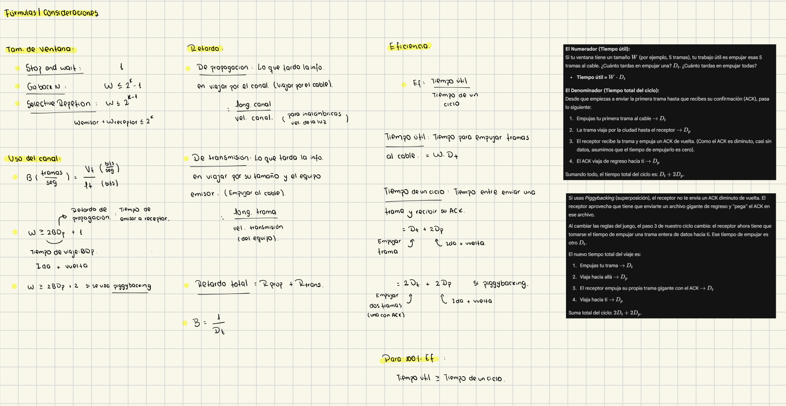

# Ventanas Corredizas

## **Suposiciones Iniciales y la Implementación Física: El rol de la NIC**

Antes de analizar la transmisión bidireccional, es fundamental comprender dónde operan estos protocolos basándonos en la suposición de procesos independientes.

*   **La Tarjeta de Interfaz de Red (NIC):** El proceso completo de la capa física y parte del proceso de la capa de enlace de datos se ejecutan en un hardware dedicado llamado NIC (Network Interface Card). El resto de la capa de enlace opera como un controlador (*driver*) en el sistema operativo. 
*   **Operación a "velocidad de cable":** Las implementaciones en hardware de las NIC están diseñadas para gestionar las tramas exactamente de forma tan rápida como llegan al enlace físico, evitando desbordamientos a nivel local. Técnicas de optimización como el *piggybacking* impactan directamente en este hardware al reducir la cantidad total de tramas que la NIC debe procesar mediante interrupciones.

## **Gestión de Canales Ruidosos mediante ARQ (Petición Automática de Repetición)**
Dado que los canales de comunicación sufren perturbaciones, la capa de enlace añade un control de errores denominado ARQ o PAR (Positive Acknowledgement with Retransmission).
*   **Características Técnicas del ARQ:**
    *   Exige que el receptor confirme obligatoriamente la recepción enviando una trama de Acuse de Recibo (ACK).
    *   El emisor utiliza un temporizador (*timer*) y reenvía automáticamente las tramas si no recibe la confirmación antes de que el tiempo expire.
    *   Obliga estrictamente a que tanto las tramas de datos como los ACKs estén **numerados**.
    *   La numeración es vital: si no existiera, el receptor no podría distinguir tramas nuevas de duplicados retransmitidos (causados por la pérdida de ACKs o finalización prematura de *timers*).
    *   Para protocolos simples como *Stop-and-Wait* (parada y espera), basta con utilizar un campo de secuencia de 1 bit (alternando entre los números 0 y 1).

## **Transmisión Bidireccional (Full-Duplex)**
Para lograr enviar datos en ambas direcciones sin desperdiciar canales físicos separados, los protocolos permiten que **las tramas de datos y las tramas de control ACK se intercalen** armónicamente transitando sobre el mismo enlace de comunicación.

### **Piggybacking (Superposición)**
Es una técnica técnica de optimización crítica para la transmisión bidireccional, enfocada en no desperdiciar ancho de banda enviando tramas que contengan únicamente información de control.
*   **Mecanismo:** El receptor **retarda temporalmente** el envío de su confirmación de recepción (ACK). Su objetivo es incluir o "superponer" este ACK directamente dentro del campo correspondiente en la cabecera de la siguiente trama de datos saliente.
*   **Ventajas del Piggybacking:**
    *   **Mejor uso del ancho de banda del canal:** Al acoplar el ACK, se evita desperdiciar la capacidad enviando una trama de control separada (que requeriría su propia cabecera completa y suma de comprobación). El campo superpuesto suele costar apenas 1 bit adicional en la cabecera.
    *   **Menor carga de procesamiento en el receptor (Impacto en la NIC):** Al agrupar los datos con la confirmación, se envía un menor número total de tramas a través del medio, reduciendo significativamente el trabajo de procesamiento e interrupciones en las tarjetas de red.
*   **Desventajas / Complicaciones:**
    *   **Incertidumbre temporal:** Es necesario determinar el tiempo exacto que la capa de enlace debe esperar por un paquete de la capa de red para adjuntarle el ACK.
    *   **Riesgo de retransmisiones innecesarias:** Si la capa de enlace espera demasiado tiempo y se supera el límite del *timer* del emisor original, este asumirá una falla y retransmitirá la trama, anulando el propósito de la confirmación.
    *   **Obliga a usar esquemas *ad hoc*:** Como la capa de enlace no puede predecir cuándo llegará un paquete de red, requiere la configuración de temporizadores auxiliares que esperan un número fijo de milisegundos; si no hay datos nuevos para enviar en ese lapso, el sistema se rinde y envía una trama de control ACK separada.

*   **Casos ilustrados:** Los diagramas contrastan un **"Caso normal"** (donde las tramas y los ACKs superpuestos fluyen armónicamente y cada paquete es aceptado, marcado con un asterisco) frente a un **"Caso anormal"** o peculiaridad de sincronización (donde A y B inician la comunicación simultáneamente, cruzando sus primeras tramas y provocando la entrega de duplicados en la capa de enlace, aunque no haya errores de transmisión en el cable).

## **Ventanas Corredizas y Pipelining**
*   **El problema inicial:** Los protocolos básicos de parada y espera (*Stop-and-Wait*) son ineficientes porque el emisor se bloquea tras enviar una sola trama hasta recibir su confirmación, desperdiciando ancho de banda, especialmente en enlaces con alto retardo.
*   **La solución (Pipelining):** El uso de ventanas corredizas permite la **canalización** o *pipelining*. Esto significa que el protocolo autoriza al emisor a transmitir múltiples tramas consecutivas antes de requerir un acuse de recibo, llenando el canal de datos y logrando un uso eficiente del enlace.

### **Dinámica y Funcionamiento de las Ventanas**
El sistema se basa en mantener dos "ventanas" lógicas de números de secuencia, una en el origen y otra en el destino:

*   **La Ventana del Emisor (Sending Window):**
    *   Mantiene un grupo de números de secuencia correspondientes a las tramas que el emisor **tiene permitido enviar**.
    *   El **extremo inferior** de esta ventana avanza (se desliza) únicamente cuando se recibe la confirmación (ACK) de las tramas más antiguas.
    *   El **extremo superior** avanza con la llegada de nuevos paquetes desde la capa de red que deben ser enviados.
    *   **Requisito de Memoria:** El emisor está obligado a mantener en búferes (*buffers*) todas las tramas que están dentro de la ventana por si ocurre un error y necesitan ser retransmitidas.
*   **La Ventana del Receptor (Receiving Window):**
    *   Mantiene los números de las tramas que **puede recibir y aceptar**.
    *   Avanza o se desliza cuando el receptor procesa tramas ordenadas y las envía hacia la capa superior (capa de red).
    *   **Requisito de Memoria:** Necesita espacio en búferes para almacenar las tramas que llegan, especialmente si llegan fuera de orden.
    *   Generalmente, esta ventana es de tamaño fijo.
*   **Independencia de tamaños:** Las ventanas de emisión y recepción **no necesariamente son del mismo tamaño**; sus dimensiones varían dependiendo del protocolo específico implementado.

### **Características de la Comunicación con Ventanas Corredizas**
Para que este mecanismo funcione sin ambigüedades en canales ruidosos, exige las siguientes condiciones:
*   **Tramas numeradas:** Es estrictamente obligatorio que cada trama posea un número de secuencia en su cabecera.
*   **Mecanismos de confirmación:** Para que el receptor confirme al emisor qué tramas llegaron correctamente, utiliza dos métodos principales:
    *   **Superposición (Piggybacking):** El acuse de recibo se inserta en la cabecera de una trama de datos que viaja en dirección opuesta.
    *   **Trama de control ACK:** Una trama dedicada exclusivamente a confirmar la recepción, usada si no hay datos que enviar en la dirección opuesta.
*   **Confirmaciones negativas (NAK):** El receptor puede utilizar tramas especiales (NAK) para solicitar de forma explícita la retransmisión temprana de una trama específica que llegó con errores.

### **Tipos de Protocolos de Ventanas Deslizantes**

#### **1. Protocolo de Parada y Espera (Stop-and-Wait)**
Este es el protocolo fundamental y más restrictivo. El emisor transmite una sola trama y se bloquea hasta recibir la confirmación antes de enviar la siguiente.

*   **Características Técnicas:**
    *   **Tamaño de Ventana del Emisor:** Exactamente **1**.
    *   **Tamaño de Ventana del Receptor:** Exactamente **1**.
    *   **Numeración de secuencias:** Dado que solo hay una trama pendiente a la vez, basta con utilizar **1 bit** para el campo de secuencia, alternando únicamente entre los números **0 y 1**.
*   **Desventajas:**
    *   En canales con un alto producto de ancho de banda-retardo (por ejemplo, enlaces satelitales), la eficiencia de este protocolo es catastrófica, ya que el emisor pasa la mayor parte del tiempo inactivo esperando el acuse de recibo (ACK).

#### **2. Protocolo de Retroceso-N (Go-Back-N)**
Diseñado para mejorar la eficiencia permitiendo enviar múltiples tramas sin esperar confirmación, pero manteniendo un receptor extremadamente simple.

*   **Características Técnicas y Comportamiento:**
    *   **El receptor es rígido:** Solo acepta tramas que llegan en **orden estricto**.
    *   **Manejo de Errores:** Si una trama llega dañada o se pierde, el receptor simplemente la ignora y, a partir de ese momento, **descarta todas las tramas subsecuentes** (aunque lleguen en perfecto estado) porque no están en el orden esperado.
    *   **Acción del Emisor:** El emisor, al agotar el temporizador (*timeout*) de la trama perdida, se ve obligado a retroceder y **retransmitir la trama dañada junto con todas las tramas que le seguían**.
    *   **Acuse de recibo acumulativo:** El receptor envía un ACK indicando el número de la siguiente trama que espera. Un ACK de la trama *n* confirma implícitamente la correcta recepción de todas las tramas anteriores ($n-1, n-2...$).
*   **Fórmulas Matemáticas y Límites:**
    *   **Número Máximo de Secuencia ($MAX\_SEQ$):** Si el campo de secuencia tiene $k$ bits, el valor máximo es **$MAX\_SEQ = 2^k - 1$**. Ejemplo: Si $k = 3$, $MAX\_SEQ = 7$ con 8 ranuras en total.
    *   **Tamaño Máximo de Ventana del Emisor:** La ventana del emisor debe ser $\le MAX\_SEQ$ (no $MAX\_SEQ + 1$). Si fuera mayor, el emisor no podría distinguir si un ACK es por un lote nuevo de tramas o por el lote anterior retransmitido.

#### **3. Protocolo de Repetición Selectiva (Selective Repeat)**
Es el protocolo más complejo y eficiente. Su filosofía es no desperdiciar el ancho de banda retransmitiendo tramas que ya llegaron correctamente.

*   **Características Técnicas y Comportamiento:**
    *   **El receptor es flexible:** Posee una ventana de recepción mayor a 1, lo que le permite **aceptar tramas en cualquier posición dentro de su ventana**, incluso si llegan fuera de orden.
    *   **Almacenamiento (Buffering):** Las tramas correctas que llegan después de un error se **almacenan en memorias intermedias** (*buffers*) del receptor a la espera de que se repare el hueco.
    *   **Acuses de recibo negativos (NAK):** Cuando el receptor detecta un hueco en la secuencia o un error de suma de comprobación, envía proactivamente una trama de control **NAK** al emisor para solicitar explícitamente la retransmisión de esa trama específica, antes de que expire el temporizador normal.
    *   **Acción del Emisor:** Solo retransmite **única y exclusivamente** la trama que falló (la solicitada por el NAK o la que agotó su temporizador).
*   **Fórmulas Matemáticas y Límites Estrictos:**
    *   **Tamaño Máximo de Ventana:** Para evitar problemas de ambigüedad por superposición de ventanas (donde el receptor no sepa si una trama pertenece a la ventana actual o es un duplicado de la anterior), el tamaño máximo de la ventana está estrictamente acotado por la fórmula: **$W_{max} = (MAX\_SEQ + 1) / 2$** o **$W_{max} \leq 2^{k-1}$**. Por ejemplo: con un número de secuencia de k = 3 bits, el tamaño máximo de ventana es 4.

### **Fórmulas Matemáticas: Eficiencia y Ancho de Banda-Retardo (BD)**

*   **Variables fundamentales:**
    *   **$V_t$:** Tasa de bits o velocidad de transmisión del canal.
    *   **$L_t$:** Longitud total de la trama en bits.
    *   **$B$:** Frecuencia de envío de tramas, calculada como $B = V_t / L_t$ (tramas por segundo).
    *   **$D_p$:** Retardo de propagación del canal (segundos).
    *   **$D_t$:** Tiempo de transmisión de la trama.
    *   **$W$:** Tamaño de la ventana corrediza (cantidad máxima de tramas en vuelo).

*   **Teoremas de Utilización del Enlace:**
    *   Para asegurar una utilización alta (100%) del enlace sin que el emisor se bloquee, el tamaño de la ventana debe cumplir la desigualdad: **$W \ge 2BD_p + 1$**.
    *   La eficiencia general o utilización del enlace está acotada por: **$Ef \le W / (1 + 2BD_p)$**.

*   **Cálculo de Eficiencia ($Ef$) según el tipo de Acuse de Recibo (ACK):**
    *   **Caso 1: Usando tramas de control ACK dedicadas:**
        * $Ef = \frac{W \cdot D_t}{2D_p + D_t}$
        * **$Ef = \frac{W}{2D_p \cdot B + 1}$**.
    *   **Caso 2: Usando Piggybacking (ACK superpuesto en tramas de datos):**
        * $Ef = \frac{W \cdot D_t}{2D_p + 2D_t}$
        * **$Ef = \frac{W}{2D_p \cdot B + 2}$**.

## **Protocolos de Enlace de Datos en la Práctica**

Esta sección aborda tres arquitecturas fundamentales utilizadas para conectar usuarios y enrutadores en Internet: Packet over SONET, ADSL y DOCSIS.

#### **1. Packet over SONET y el Protocolo PPP**
Packet over SONET es el método estándar empleado para transportar paquetes IP a través de enlaces de fibra óptica de área extensa (como las redes troncales de las telefónicas). Para lograr este entramado sobre el flujo continuo de bits de SONET, se utiliza el **PPP (Point-to-Point Protocol)**.

*   **Características y Funciones Exhaustivas de PPP:**
    *   Proporciona un método de entramado no ambiguo que delimita claramente el fin e inicio de tramas.
    *   Realiza control y detección de errores.
    *   Utiliza el protocolo **LCP (Link Control Protocol)** para levantar la línea, probarla, negociar opciones y bajarla.
    *   Utiliza el protocolo **NCP (Network Control Protocol)** para negociar opciones de la capa de red de manera independiente al protocolo de red utilizado.
    *   Performa configuración dinámica de enlaces.
    *   Permite la autenticación de las partes.
    *   Comprime los encabezados de los paquetes.
    *   Verifica constantemente la calidad de los enlaces.
    *   Soporta *Multilink*, permitiendo gestionar otras conexiones físicas si las hubiere.

*   **Análisis Visual: Formato de la Trama PPP**
    *   El diagrama ilustra que PPP es un protocolo **orientado a bytes** que utiliza **relleno de bytes (byte stuffing)**. 
    *   La estructura mostrada incluye los siguientes campos: **Flag** (01111110 o 0x7E, 1 byte), **Address** (11111111, 1 byte), **Control** (00000011, 1 byte), **Protocol** (1 o 2 bytes), **Payload** (longitud variable), **Checksum** (2 o 4 bytes) y un **Flag** de cierre (1 byte).
    *   *Detalle técnico visual:* Se menciona que los campos Address y Control se usan por defecto para el "modo no numerado", pero pueden ser omitidos negociando vía LCP para ahorrar ancho de banda. Además, los datos del Payload son "revueltos" (scrambled) usando una función XOR antes de enviarlos a SONET para evitar largas cadenas de ceros que afecten la sincronización física.

*   **Análisis Visual: Diagrama de Estados de PPP**
    El esquema de bloques con flechas direccionales ilustra el ciclo de vida exacto de un enlace PPP:
    1.  **Dead (Muerto):** Estado inicial o cuando la portadora cae (*Carrier dropped*).
    2.  **Establish (Establecer):** Negociación de opciones mediante LCP. Si ambas partes acuerdan, avanza.
    3.  **Authenticate (Autenticar):** Verificación de identidad exitosa.
    4.  **Network (Red):** Configuración mediante el protocolo NCP.
    5.  **Open (Abierto):** Estado donde ocurre la transferencia de datos.
    6.  **Terminate (Terminar):** Cierre de la conexión (lleva de nuevo al estado *Dead*).

#### **2. ADSL (Asymmetric Digital Subscriber Line)**
ADSL conecta a los abonados domésticos a Internet utilizando el mismo bucle local de cobre de la red telefónica clásica. 

*   **Pila de Protocolos y Tecnologías Involucradas (Análisis Visual):**
    El diagrama de red muestra un PC en el domicilio del cliente conectado a un **módem DSL**, que viaja por el bucle local hasta un equipo **DSLAM (DSL Access Multiplexer)** en la oficina del ISP.
    *   **ATM (Asynchronous Transfer Mode):** Es el protocolo de capa de enlace utilizado. Su característica estricta es que **utiliza celdas de tamaño fijo de exactamente 53 bytes** (48 bytes de carga útil y 5 bytes de encabezado). Es orientado a la conexión y usa un identificador de circuito virtual.
    *   **AAL5 (ATM Adaptation Layer 5):** Es la capa de adaptación y formato utilizado para poder enviar paquetes grandes sobre las celdas pequeñas de ATM.
    *   **PPPoA (PPP over ATM):** La trama PPP es convertida y encapsulada dentro de una trama AAL5. 

*   **Análisis Visual: Formato de Carga Útil AAL5**
    El diagrama muestra cómo se inserta la información de PPP: 
    *   El **PPP protocol** (1 o 2 bytes) y el **PPP payload** (variable) forman la carga útil de AAL5. 
    *   Se le añade un **Pad o Relleno** (0 a 47 bytes) para redondear a un múltiplo de 48, seguido de un campo **Unused** (2 bytes), la **Length o Longitud** (2 bytes) y un **CRC** (4 bytes) que hace innecesario el CRC original del PPP.

#### **3. DOCSIS (Data Over Cable Service Interface Specification)**
DOCSIS es el estándar utilizado para proveer servicios de datos sobre redes de televisión por cable híbridas (HFC).

*   **Características y Arquitectura Exhaustivas:**
    *   Se divide conceptualmente en dos componentes estrictos: **Capa Física (PHY)** y **Media Access Control (MAC)**.
    *   **Flujos de servicio (Service flows):** La transmisión se basa en secuencias unidireccionales de tramas.
    *   **Flujo de servicio primario:** Permite al CMTS (Cable Modem Termination System) enviar mensajes de control a cada módem.
    *   Cada flujo posee un identificador único y parámetros de Calidad de Servicio (QoS).
    *   El CMTS es el jefe de la red: le indica a cada Cable Módem los canales a utilizar y le provee las claves de cifrado.
    *   **Perfil de modulación:** Es una lista de órdenes de modulación que se aplican a las subportadoras OFDM, agrupando a los módems según su rendimiento.

*   **Análisis Visual: Asignación de trama a Palabra de Código (Codeword)**
    A diferencia de otros protocolos, DOCSIS requiere empaquetar las tramas en palabras de código con fuerte corrección de errores (FEC). El diagrama muestra un esquema complejo de bytes:
    *   Señala punteros lógicos como el **PDU Ptr**, el fin de la PDU anterior (**End of previous PDU**) y el inicio de la siguiente (**Start of Next PDU**).
    *   La base de la transmisión está dividida en bloques rigurosos: **CW header** (Cabecera de 2 bytes), el **Payload** (Carga útil de 1 a 1777 bytes), la **BCH parity** (Paridad BCH de 21 bytes) y la **LDPC parity** (Comprobación de Paridad de Baja Densidad de 21 bytes), terminando en un campo **S** (0-2 bytes). Esto evidencia el uso de códigos FEC avanzados explicados en la sección de control de errores.