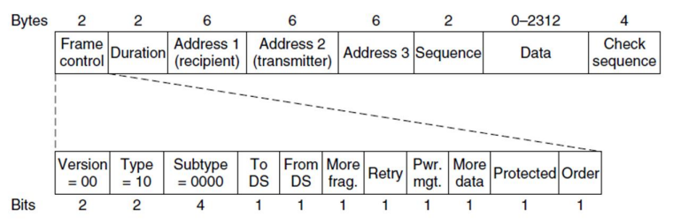

# **Tramas 802.11**

## **Clasificación de Tramas del Estándar IEEE 802.11**

A diferencia de Ethernet, que utiliza un solo tipo de trama básica, las complejidades del medio inalámbrico obligan al estándar IEEE 802.11 a dividir sus tramas en **tres clasificaciones principales**:

1.  **Tramas de Administración (Management):** Se utilizan para establecer y mantener la comunicación inicial. Incluyen las solicitudes de asociación, autenticación y las importantes tramas *Beacon* (balizas) que los **AP** (*Access Point* - Punto de Acceso) emiten para anunciar la existencia de la red.
2.  **Tramas de Control:** Se utilizan para asistir en la entrega de las tramas de datos y administrar el acceso al canal.
3.  **Tramas de Datos:** Son las que transportan la información útil del usuario (la carga útil o *payload*).

## **Análisis de las Tramas de Control**

Estas tramas son cortas y vitales para el funcionamiento del protocolo MAC (como el CSMA/CA). Se clasifican exhaustivamente en:

*   **RTS (*Request To Send* - Solicitud para enviar):** Utilizada por una estación para pedir la reserva del canal y anunciar la duración de su transmisión para evitar el problema de la terminal oculta.
*   **CTS (*Clear To Send* - Listo para enviar):** Respuesta del receptor confirmando la reserva. Silencia al resto de la red alimentando sus temporizadores virtuales **NAV** (*Network Allocation Vector*).
*   **ACK (*Acknowledgment* - Acuse de recibo):** Trama obligatoria enviada por el receptor para confirmar que el paquete llegó sin errores (colisiones).
*   **PS-Poll (*Power Save-Poll* - Sondeo de ahorro de energía):** Usada por una estación móvil que acaba de despertar para solicitarle al AP las tramas que almacenó para ella mientras dormía.
*   **CF-end (*Contention-Free end* - Fin de libre contención):** Se usa exclusivamente en el modo centralizado (PCF). El AP la emite para anunciar formalmente a todas las estaciones el fin del periodo libre de contención (el periodo donde el AP repartía los turnos pacíficamente). Al escuchar esta trama, las estaciones saben que el canal ha regresado al modo DCF y pueden volver a la competencia normal (contención) por el medio usando sus temporizadores aleatorios y el protocolo CSMA/CA clásico.

## **Estructura Exhaustiva de la Trama de Datos 802.11**

Una trama de datos regular se compone de los siguientes campos exactos. *Nota: La cantidad de direcciones MAC varía dependiendo de la ruta, una característica única de Wi-Fi*.

#### **1. Frame Control (Control de Trama) - 2 Bytes (16 bits)**
Este campo es el "panel de interruptores" de la trama. Contiene los siguientes **11 subcampos**:
*   **Versión (2 bits):** Actualmente fijado en `00`. Permite compatibilidad con futuras versiones del protocolo.
*   **Type / Tipo (2 bits):** Define la clase de trama. `00` para Administración, `01` para Control y `10` para Datos.
*   **Subtype / Subtipo (4 bits):** Detalla el tipo de trama. Para una trama de datos regular es `0000`. En tramas de control, indica si es un RTS, CTS, etc.
*   **To DS (*To Distribution System*) (1 bit):** Si es `1`, la trama va dirigida hacia la red cableada (el Sistema de Distribución o servidor) a través del AP.
*   **From DS (*From Distribution System*) (1 bit):** Si es `1`, la trama proviene de la red cableada hacia una estación inalámbrica.
*   **More frag. (*More Fragments*) (1 bit):** Indica si la transmisión es parte de un paquete mayor y le seguirán más fragmentos.
*   **Retry / Reintento (1 bit):** Marca si la trama es una retransmisión de un intento fallido anterior (ayuda a descartar duplicados).
*   **Pwr mgt (*Power Management*) (1 bit):** Avisa al receptor (generalmente el AP) que la estación emisora entrará en modo de ahorro de energía tras enviar esta trama.
*   **More data / Más datos (1 bit):** El AP lo usa para avisar a una estación que tiene más tramas en cola listas para enviarle.
*   **Protected / Protegido (1 bit):** Indica si el cuerpo de la trama ha sido cifrado por seguridad (ej. mediante WPA2/WPA3).
*   **Order / Orden (1 bit):** Indica al receptor que las capas superiores exigen que las tramas se procesen estrictamente en el orden en que fueron enviadas.

#### **2. Duration / Duración - 2 Bytes**
*   **Características Técnicas:** Contiene un valor en microsegundos ($\mu s$) que indica cuánto tiempo el canal estará ocupado por esta trama y su correspondiente trama ACK. Todas las estaciones que escuchan este valor lo usan para actualizar su reloj interno **NAV** y mantenerse en silencio.

#### **3. Campos de Dirección MAC (Address 1, 2, 3 y opcionalmente 4) - 6 Bytes cada una**
Aquí radica la magia del enrutamiento Wi-Fi. Debido a que el **AP** actúa como un relé (puente) hacia otras redes (el **DS**), se necesitan saber no solo el origen y el destino final, sino también qué radios físicas están hablando. La combinación se dicta estrictamente por los bits **To DS / From DS**:
*   `00` (Red Ad hoc): *Address 1* = Destino, *Address 2* = Origen, *Address 3* = ID de BSS (Identificador de la red).
*   `01` (Del AP a la Estación): *Address 1* = Destino (Estación), *Address 2* = AP Emisor (Transmisor de radio), *Address 3* = Origen original.
*   `10` (De la Estación al AP): *Address 1* = AP Receptor (Radio receptora), *Address 2* = Origen (Estación), *Address 3* = Destino final.
*   `11` (Entre dos APs formando un puente WDS): Requiere el uso de **Address 4**. *Address 1* = AP Receptor, *Address 2* = AP Emisor, *Address 3* = Destino final, *Address 4* = Origen original.
  
Si se necesita la cuarta dirección, se coloca luego del campo Secuencia y ocupa 6 bytes (que usa del payload, disminuyendo su limite máximo de 2312 bytes a 2306 bytes).

#### **4. Sequence / Secuencia - 2 Bytes**
*   **Características Técnicas:** Sirve para renumerar tramas y detectar duplicados (ya que los ACK perdidos causan retransmisiones innecesarias). Se divide en **12 bits** para el número de secuencia general de la trama y **4 bits** para el número del fragmento (si la trama fue cortada en partes más pequeñas).

#### **5. Data / Carga Útil - Variable (0 a 2312 Bytes)**
*   **Características Técnicas:** Aquí viaja la información útil (el paquete IP). Empieza con una subcabecera obligatoria en formato **LLC** (*Logical Link Control* - Control de Enlace Lógico), que sirve como "pegamento" para identificar qué protocolo de capa superior (ej. IPv4 o IPv6) se está transportando.

#### **6. Check Sequence / Secuencia de comprobación de trama (CRC) - 4 Bytes (32 bits)**
*   **Características Técnicas:** Es el código detector de errores **CRC** (*Cyclic Redundancy Check* - Comprobación de Redundancia Cíclica). Si la trama sufre interferencias de radio, el cálculo matemático del CRC fallará y el receptor destruirá la trama silenciosamente, obligando al emisor a reintentar.

